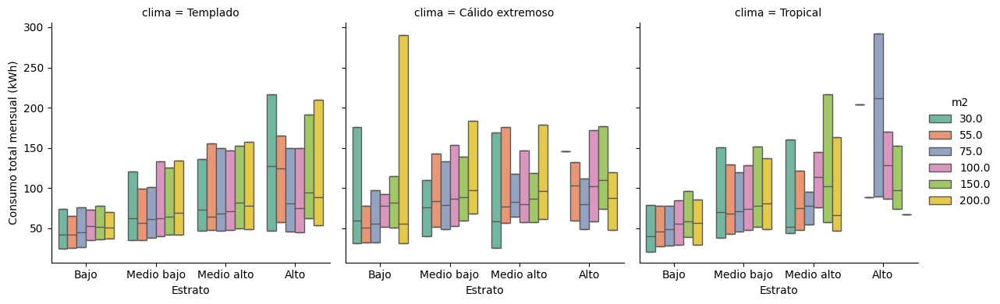
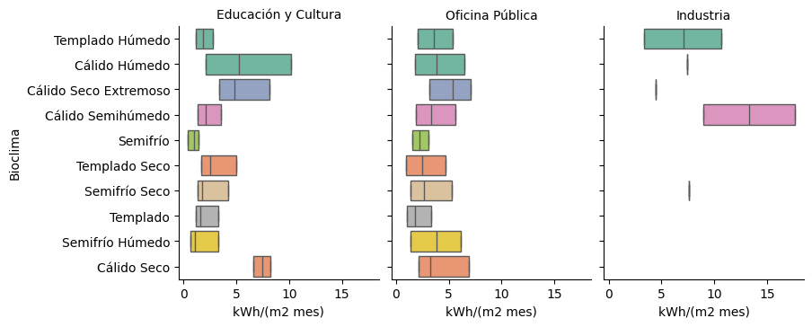

## Objetivo

 
 
 
 
Calcular el consumo energético eléctrico mensual de  vivienda 
y edificios de la APF con los datos existentes.

## Datos de vivienda

- Estudio del subsidio Hernández y Patiño, 2022
- Basado en ENCEVI y ENIGH 2018
  - Personas
  - Hogares
  - Materiales de vivienda
  - Factor de expansión de vivienda
- Tarifas de CFE

## Desagregación 

- Tipología $m^2$
- Uso y no uso de aire acondicionado
- Clima (3 INEGI)
- Estrato socioeconómico
- Región (nacional, estado)

## Datos de edificaciones de la APF

- Datos CONUEE
- Ubicación geográfica (clima)
- Uso o no uso de aire acondicionado
- Clasificación de uso (13 categorías)
- Área total
  

## Análisis para vivienda

- Consumo eléctrico mensual en $kWh$
- Cuartiles 25, 50 y 75
- Desagregación
  - Tipología
  - Uso y no uso de aire acondicionado
  - Clima
  - Estrato socioeconómico
  

## Análisis para edificios de la APF

- Consumo eléctrico mensual en $kWh/m2$
- Quartiles 25, 50 y 75
- Desagregación
  - Bioclima
  - Uso y no uso de aire acondicionado
  - Clasificación de uso
  

## Resultados

. . .

> Muchas tablas y muchas figuritas
>

## Tablas vivienda, sin aire acondicionado, cálido extremoso

|   m² |   P25 |   Mediana |   Media |    P75 |   %Viviendas |
|-----:|------:|----------:|--------:|-------:|-------------:|
|   30 | 31.51 |     59.44 |  109.61 | 176.09 |         0.17 |
|   55 | 31.78 |     50.42 |   60.75 |  77.65 |         0.24 |
|   75 | 32.49 |     55.04 |   76.37 |  97.51 |         0.21 |
|  100 | 51.64 |     78.07 |   78.24 |  92.06 |         0.2  |
|  150 | 50.23 |     82.14 |   89.46 | 114.49 |         0.09 |
|  200 | 30.94 |     55.08 |  151.74 | 289.86 |         0.05 |

: Consumo total mensual (kWh) para clima **Cálido extremoso**, estrato socioeconómico **Bajo** {#tbl-cálido-extremoso-bajo}

## Figuras para vivienda

 
 

## Figuras para edificios de la APF

 
 

## Referencia

Hernandez, M., & Patino-Echeverri, D. (2022). *Electricity consumption, subsidies, and policy inequalities in Mexico: Data from 100,000 households.* Energy for Sustainable Development, 71, 186–199.

Código R disponible en:
[github.com/h2mauricio/mexico-residential-electricity](https://github.com/h2mauricio/mexico-residential-electricity)

Datos disponibles en:
[research.repository.duke.edu](https://research.repository.duke.edu/)

